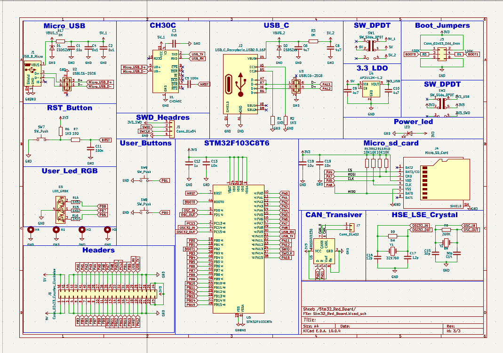
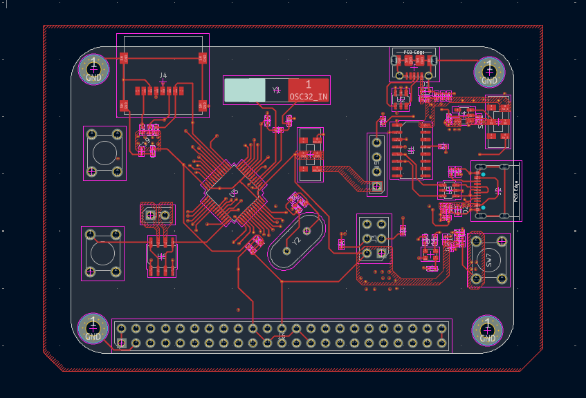
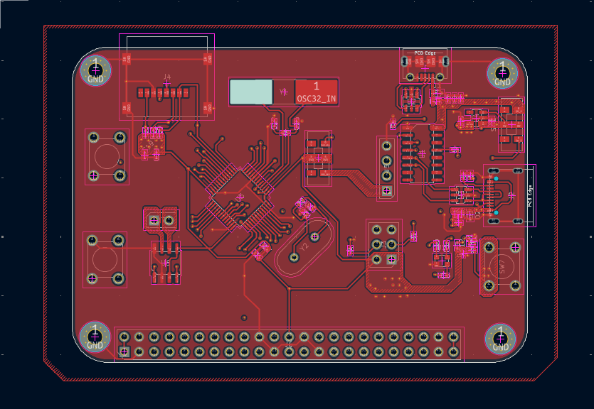
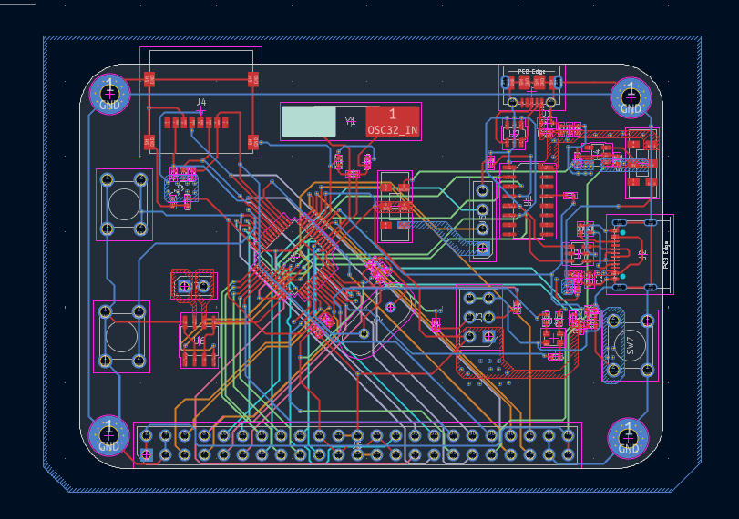

# STM32 RedBoard

Custom STM32F103C8T6 development board designed with KiCad, featuring USB-C, Micro-USB, CAN, Micro-SD, SWD and GPIO interfaces.

## Overview

The STM32 RedBoard is an open-source hardware development platform built around the ARM Cortex-M3-based STM32F103C8T6 microcontroller. The board integrates multiple connectivity options and interfaces, designed for embedded systems development, prototyping, and educational projects using professional-grade open-source tools.

## Features

- **Microcontroller**: ARM Cortex-M3 STM32F103C8T6 (72 MHz)
- **Memory**: 256 KB Flash, 64 KB SRAM
- **Connectivity**: USB-C and Micro-USB interfaces, CAN 2.0B support, Micro-SD card interface
- **Debugging**: Serial Wire Debug (SWD) interface for real-time debugging and firmware upload
- **Expansion**: GPIO pins for sensor integration and custom applications
- **Design**: Professional schematic and PCB layout in KiCad 10.0

## Hardware Specifications

| Specification | Value |
|---|---|
| Microcontroller | STM32F103C8T6 (ARM Cortex-M3, 72 MHz) |
| Flash Memory | 256 KB |
| SRAM | 64 KB |
| Supply Voltage | 3.3V (USB or external) |
| Interfaces | USB-C, Micro-USB, CAN, SWD, Micro-SD, GPIO |
| EDA Tool | KiCad 10.0 |

## Interfaces

### USB-C (Primary Interface)
USB Type-C 2.0 interface for primary power supply and data communication. Features reversible plug orientation and robust mechanical connection.

### Micro-USB (Secondary Interface)
USB Micro Type-B connector for alternative power and communication. Provides legacy compatibility and additional charging capability.

### CAN Bus
CAN 2.0B protocol support for vehicle diagnostics, industrial automation, and real-time control systems. Uses differential signaling with CAN_H and CAN_L lines.

### Micro-SD Card Interface
8-pin Micro SD Card Socket supporting SDIO/SPI modes. Enables data storage, firmware updates, and data logging applications.

### SWD (Serial Wire Debug)
ARM Serial Wire Debug interface for real-time debugging and firmware programming. Compatible with ST-LINK/V2, Segger J-Link, and OpenOCD-compatible debuggers.

### GPIO Expansion
Multiple GPIO pins from the STM32F103C8T6 with 3.3V logic levels (5V tolerant on selected pins). Supports digital I/O, PWM, analog input (ADC), and timer functions.

## Hardware Design

The STM32 RedBoard is fully designed in **KiCad 10.0**, a professional, open-source electronic design automation suite supporting Windows, macOS, and Linux.

### Design Files

| File | Description |
|---|---|
| `kicad_files/stm32f013 Red board.kicad_sch` | Main schematic with all component connections and interfaces |
| `kicad_files/Block_Diagram.kicad_sch` | High-level system architecture overview |
| `kicad_files/stm32f013 Red board.kicad_pcb` | PCB layout, routing, and component placement |
| `kicad_files/stm32f013 Red board.kicad_pro` | KiCad project file |

## PCB Images

Representative design documentation images:









## Repository Structure

```
stm32-RedBoard/
├── README.md                                        # Project documentation
├── LICENSE                                          # MIT License
├── PCB_images/                                      # Design documentation images
│   ├── 1.png
│   ├── 2.png
│   ├── 3.png
│   ├── 4.png
│   ├── 5.png
│   ├── 6.png
│   └── 7.png
├── Shematics/                                       # Schematic PDF export
│   └── stm32f013 Red board-Stm32_Red_Board.pdf
└── kicad_files/                                     # KiCad project files
    ├── Block_Diagram.kicad_sch
    ├── Stm32_Red_Board.kicad_sch
    ├── stm32f013 Red board.kicad_sch
    ├── stm32f013 Red board.kicad_pcb
    ├── stm32f013 Red board.kicad_pro
    ├── stm32f013 Red board.kicad_prl
    ├── stm32f013 Red board-Stm32_Red_Board.pdf
    └── _restore_backup_*/ (version control backups)
```

## Getting Started

### Prerequisites

- **KiCad 10.0 or later** – Download from [kicad.org](https://www.kicad.org)
- **Git** (optional, for cloning the repository)

### Opening the Project

1. **Clone the repository**
   ```bash
   git clone https://github.com/EJ-JATIMohammed/stm32-RedBoard.git
   cd stm32-RedBoard
   ```

2. **Open in KiCad**
   - Launch KiCad
   - Select **File** → **Open Project**
   - Navigate to `kicad_files/stm32f013 Red board.kicad_pro`

3. **Explore the design**
   - **Schematic**: View connections and component values
   - **PCB Layout**: Review trace routing and layer assignments
   - **Block Diagram**: See `Block_Diagram.kicad_sch` for system overview
   - **3D Viewer**: View → 3D Viewer for mechanical review

### Design Tools

- **Electrical Rules Check (ERC)**: Tools → Electrical Rules Checker
- **Design Rules Check (DRC)**: Tools → Design Rules Checker
- **Manufacturing Files**: File → Plot to generate Gerber files

## Programming and Debugging

### Supported Debuggers

- **ST-LINK/V2** – Official STMicroelectronics debugger
- **Segger J-Link** – Universal JTAG/SWD debugger
- **OpenOCD** – Open-source debugging protocol

### Development Environments

- **STM32CubeIDE** – Official STMicroelectronics IDE
- **STM32CubeMX** – Configuration and code generation
- **VSCode + ARM Toolchain** – Open-source workflow
- **PlatformIO** – Cross-platform embedded development

## Future Improvements

- **Documentation**: Detailed pinout assignments, bill of materials (BOM), assembly guide
- **Firmware Examples**: USB drivers, CAN bus applications, Micro-SD file system integration, GPIO and ADC samples
- **Hardware Validation**: Prototype fabrication and functional testing
- **Design Enhancements**: 3D STEP models, EMC/EMI review, power distribution optimization

## License

This project is released under the **MIT License**. See [LICENSE](LICENSE) for complete terms.

## Author

**EJ-JATI Mohammed**  
GitHub: [EJ-JATIMohammed](https://github.com/EJ-JATIMohammed)  
Repository: [stm32-RedBoard](https://github.com/EJ-JATIMohammed/stm32-RedBoard)

---

**Project Created**: August 2026  
**Last Updated**: October 2026  
**KiCad Version**: 10.0
